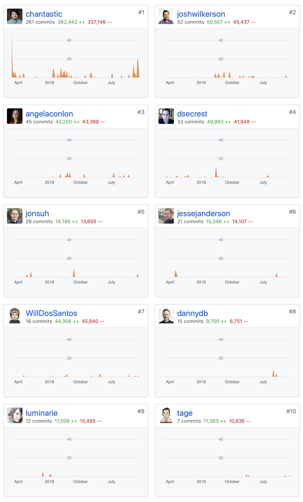
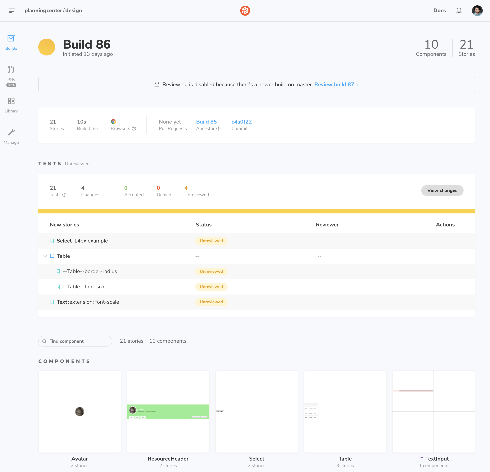
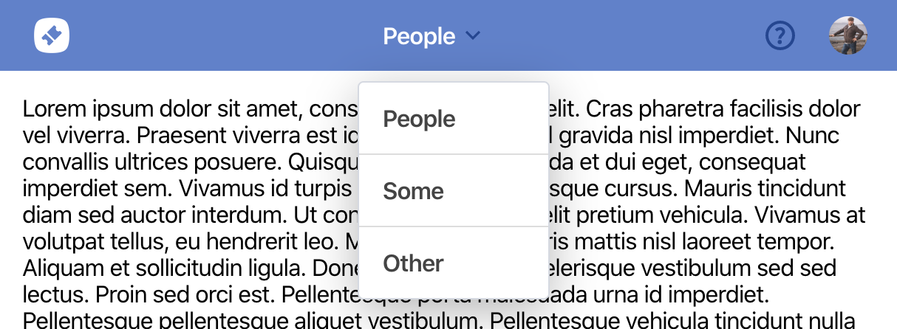

> people only know what you tell them, Carl
>
> — Frank Abagnale Jr.

I'm sitting in a meeting with the React and React Native product teams, talking about public messaging for Suspense.  
At one point I hear myself say: “Look, it doesn’t matter how busy you are on the product. People want to know what you’re up to. They want a regular glimpse into the process.”

It took three whole weeks for it to dawn on me: "Crap. I'm guilty of the same thing."

How's that for self-awareness?

In any case, it's time to take my own advice, follow the lead Platform and Publishing, and invite you into what I've been up on Global Design.

_Heads up, I'm posting a link to this in Basecamp,_  
_So we might cover stuff you already know for the benefit of others._

### TL;DR

Global Design believes in designers.  
We believe that collaboration is the future of design (lowercase "d") at planning center. It's the only way we'll uncover what a shared planning center experience looks like for customers. And we believe that every team provides a critical perspective into that shared experience.

As Global Design, we're working to find and replicate that shared experience.  
So, we did some things and we have more things planned.

### TL;M(ight)R

This post is the first of two.

It's hard to see where we're going, and why, without remembering what we're leaving behind.

This doc covers a lot of history —  
History that is well known to designers but might be news to you.

I’ve broken the post into sections;  
Feel free to read only the headings that capture with your interests.

## Strategy

We have a four step strategy for unifying user interfaces at Planning Center:

- **Communication**
- **Foundation**
- Migration
- Formalization

Part 1 covers first two steps.  
Part 2 covers the rest.

## Communication

I went into 2019 with a notion about how Design could better operate as a team. For almost five years, we've had a structure where designers are embedded on product teams and that makes camaraderie difficult.

With different technical stacks, strategies, ages, sizes, market positions, and workflows — our products share very little design.  
But that's actually been a successful strategy.  
There's no way that each product could have — as quickly — responded to customer needs, had all design been subject to committee.

Autonomy and siloing has allowed teams to answer customers quickly.
But it's also meant a proliferation of bespoke systems.  
Some systems are small and shared — like Groups and Registrations.  
Others have a name and are publicly documented — Services UI-Kit and Interfaces.

To better collaborate, we wanted to steer the conversations away from implementation. Everyone loves to argue about frameworks and ergonomics but could have fruitful conversation about semantics and standard treatments?

We don't need to figure out developer ergonomics on day one.  
Our first priority is to agree on what users experience.

### Facts and Opinions

> We can agree on facts without threatening opinions.

This concept stood out to me as I [interviewed Phani Raju](https://reactpodcast.com/61) on the development of the Github Package Registry.

It's been a mantra for me as we do our best to create a space for conversations about semantics and treatments.

What a user experiences, sees, and interprets are the facts.
How we implement those facts are opinions.

### Component of the Month

So we kicked off a project called _Component of the Month_.  
Each month we sat down to specify what a component means and what its shared, default treatment should be.

I think these discussions were quite productive but you don't have to take my word for it;  
They're all available in Basecamp.

- Avatar specification: [first](https://3.basecamp.com/3670704/buckets/13893082/messages/2098045199) and [second](https://3.basecamp.com/3670704/buckets/13893082/messages/2098049936) drafts
- [Demographic Avatars implementation](https://3.basecamp.com/3670704/buckets/7294642/messages/2352390033)
- [Resource Header specification](https://3.basecamp.com/3670704/buckets/4998590/messages/1279691879#__recording_2152753847)
- [Text specification](https://3.basecamp.com/3670704/buckets/13893082/messages/2098053978)
- [TextInput specification](https://3.basecamp.com/3670704/buckets/13893082/messages/2098062585)
- [Table specification](https://3.basecamp.com/3670704/buckets/13893082/messages/2184306151)
- [Radio/Check specification](https://3.basecamp.com/3670704/buckets/13893082/messages/2098071163)
- [Select specification](https://3.basecamp.com/3670704/buckets/13893082/messages/2098067739)
- [The moment we realized a 14px font-size for TextInput was a terrible default](https://3.basecamp.com/3670704/buckets/13893082/messages/2154693474)
- [MenuButton (Dropdown) specification](https://3.basecamp.com/3670704/buckets/13893082/messages/2389321465)
- [Prompt Specification](https://3.basecamp.com/3670704/buckets/4998590/messages/2248307448#__recording_2323750034)
- [Surface — "Dark Mode"](https://3.basecamp.com/3670704/buckets/13893082/messages/2098133153) — this one is actually the result of a number of in-person conversations we had over Design Summit and Remote Weeks.

In my 7 years at Planning Center, I'm most proud of the growth represented in these conversations. We've learned a lot we got a lot better at it as we went.

If you clicked around, you'll notice that Angela started two of those discussions with some killer work she, Travis, and Tim had done in People.

## Foundation

> There is no way that this winter is ever going to end as long as this groundhog keeps seeing his shadow.
>
> — Phil Connors, Groundhog Day

Now, there is some bad news.

If you work on a team that isn't Church Center, Publishing, Registrations, or Services, you sit on a rigid foundation.

In fact, you sit on an open source UI library actually named "Foundation."

It's the groundhog that keeps seeing his shadow to keep us in perpetual winter.

### Check-Ins: Interfaces

When Check-Ins was created — our third product — it used a hot UI library named [Zurb Foundation](https://get.foundation). It's like [Twitter Bootstrap](https://getbootstrap.com) but with better Rails support.

When Registrations came along — our fourth product — we put that heavily customized build of Foundation into a gem called [Interfaces](https://github.com/ministrycentered/interfaces). And Interfaces became the start point of every app after that.

Interfaces was fine but — like most humans — it had to Achilles heels.

First, it had too rigid a worldview on what Planning Center apps would look and feel like. And the ownership model prevented it from being extended easily. So, when each product became more tailored to its customers, Interfaces snapped.  
It just couldn't support multiple world views.

_(More on that later...)_

The second Interfaces heel is that it preferred development ease over migration ease (something else we'll talk about later). It styles form elements directly — without a class. In practice, this makes it impractical to introduce new form elements into any app without first changing — and testing — all of the existing form elements.

I told you the news was bad.  
That's why we've been stuck with it for so long.

So, even if the end-all-be-all savior framework appeared tomorrow,  
Each product would still have to battle the dragon of Interfaces before adopting it.

### So, how to get off Interfaces?

Some apps have migrated off of their birth frameworks.  
Registrations has migrated off from Interfaces  
And Services has migrated off it's pre-Interfaces system — with Evergreen.

This makes two known strategies:

1. Rip the bandaid off. Remove the Interfaces imports for form elements, put in a replacement implementation, test-test-test, and be done.
2. Maintain two layouts — one legacy, one new-hawtness.

Strategy #2 is actually a great strategy for teams doing a systematic rewrite, e.g., Services. But, as a long-term strategy, it can be very painful. People maintains several purpose-driven layouts and asset manifests and it can be very troublesome for designers.

So, we're going to focus on strategy #1.

### Strategy #1

I'm not here to bum you out  
But to let you know that this history informs the foundational work we focused on last year.

Again, it's hard to see what we're moving toward until you identify what we're moving from.

Strategy #1 requires that we rebuild a lot of what Interfaces offers, so we can make Raiders of the Lost Ark like switcheroo.

Below are a few key efforts that have moved us closer to that change in apps.  
In Part 2, we'll go deeper into the major role they play in our thoughts on future implementations.

### Planning Center Icons

In my opinion, our most successful suite-wide, frontend tool is [planningcenter/icons](https://planningcenter.github.io/icons/). It's the original proof for my notion that designers can work together and dig out from a mountain of technical debt.

We started work on Icons three years ago as our first "get out of interfaces" effort. It went on to become the unified way to develop shared icons for React, Rails, static marketing pages, and (soon) React Native.

Last year we got Accounts, Check-Ins, Giving, Groups, Registrations, Resources, and People on the latest version of Icons and removed any trace of previous icon systems.

Church Center App will be joining soon.

I could enumerate all of the benefits of rallying around standards — caching, platform independence, and future proofing...  
But this is a post about collaboration.

Almost every designer has made meaningful contributions to this project and most have even deployed builds to npm.

If you've never published to a package registry,  
Ask a designer.  
Chances are, they can show you 🤓

This year we took it even further by [removing and deduplicating over 200 icons](https://trello.com/c/u64EqWbu/3089-▯-icon-shuffle)!

I'll say it again, I believe this is our most successful suite-wide, frontend tool to date.

## Free up `rem`

Best practices follow trends.

About the time that I got to Planning Center, the trend was to use this newfangled measurement (`rem`) for sizing. It wasn't supported in all browsers. So, the industry used [a little hack](https://snook.ca/archives/html_and_css/font-size-with-rem) and changed `rem` to be the equivalent of a `px` with a `px` as fallbacks.

This was effective but misguided.

See, the value of `rem` is that set by the user. It's a godsend for accessibility — allowing users to zoom based on text size.

Four years later, when design trended away from decimal systems and toward octal systems, we realized that our little `rem:px` hack was standing in the way of adopting a grid could better align with modular text scale.

We stopped using it — with a goal to **eventually** reset it in apps.  
We developed new projects (Giving, Groups, and Church Center) using the default `rem` but the old code remained in older apps.

So, we partnered with Accounts, Check-Ins, Registrations, and People to eradicate our hack from existence. This frees up products to use the user-scaleable `rem` value and moves us toward system where soft grid and type scale can all be relative to a base (user-controlled) value.

This has been a 6 year old pile of technical debt and it feels good to have it behind us.
And we'll be moving forward with `rem` as our systems value.

[Umbrella Trello card](https://trello.com/c/ugSybI2z/3035-free-up-rem).

## Font Family

For years we've used Lato as the font for Planning Center.  
This was another opinion provided by Interfaces.

Lato is not a system font; We got it from Google. So users had to download it along with app code. Designers had to decide how many weights and styles to support — weighing the download cost to users.

This constraint made us a bit timid about requiring new weights and styles and pushed us to use contrast as the primary tool for expressing hierarchy. As a result, we pushed much of our text _way_ below [recommended accessibility guidelines](https://webaim.org/resources/contrastchecker/).

We decided to replace Lato with a [system font stack](https://css-tricks.com/snippets/css/system-font-stack/).

A font stack uses only fonts available on our user's devices.  
These fonts have a wide range of weights and styles.  
And — because they are native — they make Planning Center products look more "at home" on Mac, Widows, Android, and Linux operating systems.

Moving forward, we'll use our new range of weights and styles to develop more readable and accessible views.  
This is a much needed baseline before establishing the semantics of typography in Planning Center UI.

This was completed across the entire product suite.

### IE11 Deprecation

If you haven't heard, we [dropped IE support for all authenticated products](https://www.planningcenter.com/blog/2019/03/ending-support-for-internet-explorer) last March.

It's important because it allows us to drop a lot of code and leverage killer new CSS features. It also taught me an important lesson...

Communication outside of Planning Center can be incredibly valuable.

GitHub dropped support for IE11 a few years ago and their stack is similar to ours — Rails + React.

I was able to pester my friends at GitHub to learn the exact method they used to notify users, plus a handful of edge cases they hadn't anticipated in their launch.

That conversation put us on the fast track to a quick, complete, and successful solution. From what I hear it's gone swimmingly for us.

I wrote more about what we did here: https://dev.to/chantastic/a-github-engineers-explains-how-to-drop-ie-support-gracefully-jlf

### Community Time

What I learned from my IE11 experience inspired me to explore ways we could be more involved in the broader development community.

For those of us that have the privilege of community or open source involvement, the benefits seem obvious. We're exposed to extended use cases, different techniques, and — in the case above — people with time-saving implementation knowledge.

We did some planning and plotting on a possible project called Community Time. Right now, it's just plan that Geo, DMa, and I formulated. We hope it can become something this year.

### Visual Regression Testing

We've setup a new testing harness for shared components.

We had many failed testing iterations in the past but our current solution of visual regression testing allows for discussions at the design level.

Instead of testing implementation, we do visual diffs.  
This style of testing is consistent with our goal for the separation of "facts and opinions".

When code is pushed, visual differences are calculated. Builds break until the visual changes are reviewed. This critical step toward code sharing ensures that what customers see is under test. And that that baseline implementations don't have a cascading impact on products.

I'll cover this in much more depth next week.

### Medium Topbar

_This project barely feels worth mentioning but its outcome is important for Part 2._
_Knowing about it might also be valuable teams with a cramped Topbar._.

Since 2017, Topbar has only come in two flavors: Small and Not Small.

As apps put more primary routes into their Topbars, we needed a third option. So, we made a Medium one.

Kinda news but not really.

The exciting part is that this didn't impact teams. We added it, some apps utilized it, other apps didn't. And when we add new features that required an update (Calendar and .test/.dev support), teams didn't have to care.

This is because Topbar is composed app-side. With no "default Topbar", we're able to support vastly different product implementations while still keeping the treatment and behavior consistent.

 

## So, how's it all working?

> If you want to go fast, go alone. If you want to go far, go together.
>
> — African Proverb

So, did communication-first worked?

I think so...

Focusing on communication gave us a platform to see what other teams were doing. It gave us a stronger awareness of what's happening across the suite and it opened our mind to all the disparate cases any shared implementations needs to handle.  
It's also improved our ability to mobilize in the **foundation** and **migration** phases.

Paying down a mountain of technical debt across 8 apps — all with different production cycles — is no small feat. The groundwork for many of these plans was set in motion three or more years ago and only in 2019 were the last checklist items checked.

But I feel good with the steady undercurrent of progress and how we've achieved it together — no one left behind. Communicating our goals has given us an improved sense of camaraderie.

Designers have crossed product lines to offer help toward a this common goals. We all want to make sure that today is the last day the groundhog see's his shadow.

That feels good.

### Challenges but not dealbreakers

The biggest challenge for me has been navigating product release cycles. We've had a lot of work start, then stop, start again but needing to be updated, and some lost forever. Though, that's improved quite a bit as all teams become more familiar with the brader goals and outcomes.

## To be continued...

> Don't miss next week's exciting episode: Bullwinkle's Wild Ride _or_ Goodbye Darling...

Today covers the high-level part of our strategy (**communication**) and the history that stands in the way (**foundation**).

Next week I'll share how the projects above inform our vision for a unified future.

I can't wait...
